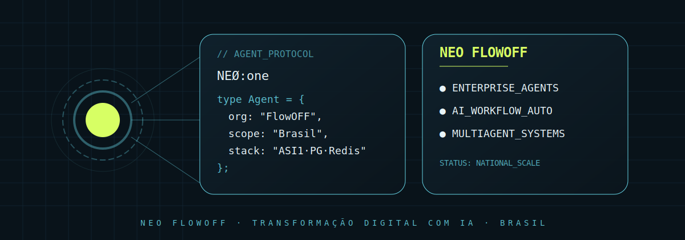

<!-- markdownlint-disable MD003 MD007 MD013 MD022 MD023 MD025 MD029 MD032 MD033 MD034 -->
# NEØ:one — NEO FlowOFF CHAT UI



```text
========================================
       NEØ:One · CHAT INTERFACE
========================================
Status:  ACTIVE
Version: v1.1.0
Type:    PWA (Progressive Web App)
========================================
```

## ⟠ Objetivo

Interface de atendimento do agente NEØ:One — assistente de
primeiro contato da NEO FlowOFF, agência especializada em
automação de marketing e infraestrutura digital autônoma.

O sistema opera como um front-end direto (estilo ChatGPT), focado
em proporcionar uma experiência humana, consultiva e de alta
conversão para empresários e visionários.

────────────────────────────────────────

## ⧉ Diferenciais

▓▓▓ CAPACIDADES
────────────────────────────────────────
└─ Respostas em tempo real e inteligentes.
└─ Memória de contexto para conversas fluidas.
└─ Captura automática de dados qualificados (CRM).
└─ Interface mobile-first ultra-rápida (PWA).
└─ Foco total em ROI e escala de negócios.

────────────────────────────────────────

## ◬ Documentação

Para detalhes de infraestrutura, stack técnica e comandos de
desenvolvimento, consulte o arquivo:
👉 [**SETUP.md**](./SETUP.md)

────────────────────────────────────────

```text
▓▓▓ Neo Mello
────────────────────────────────────────
Fundador · NEO FlowOFF
neo@neoflowoff.agency · (62) 98323-1110

"Automação de marketing e infraestrutura
digital autônoma."

Security by design.
────────────────────────────────────────
```
